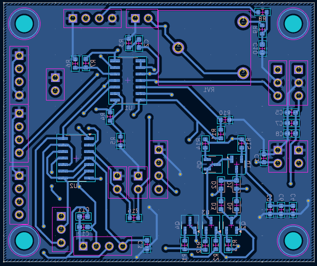
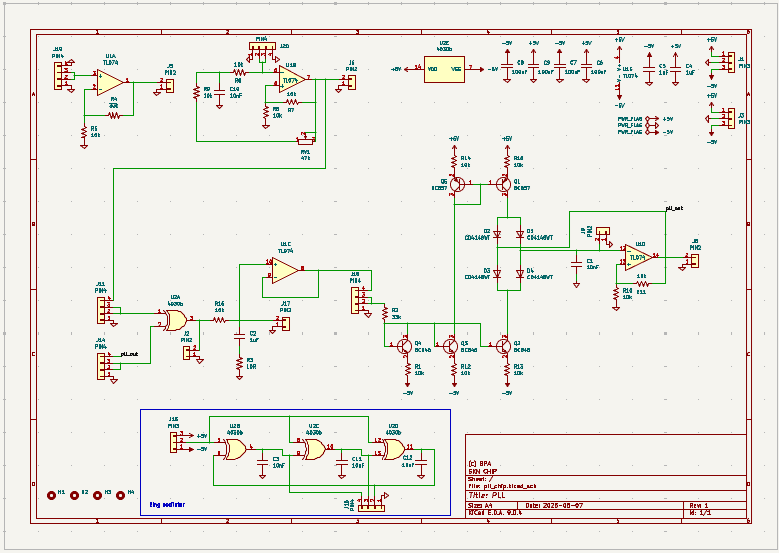

# Project of PLL

This repository covers designing the PLL schematic (LTSpice), creating the PCB layout, soldering and testing. Furthermore, there is the simple 3D model of case printed using 3D printer.

  
  

  
  

